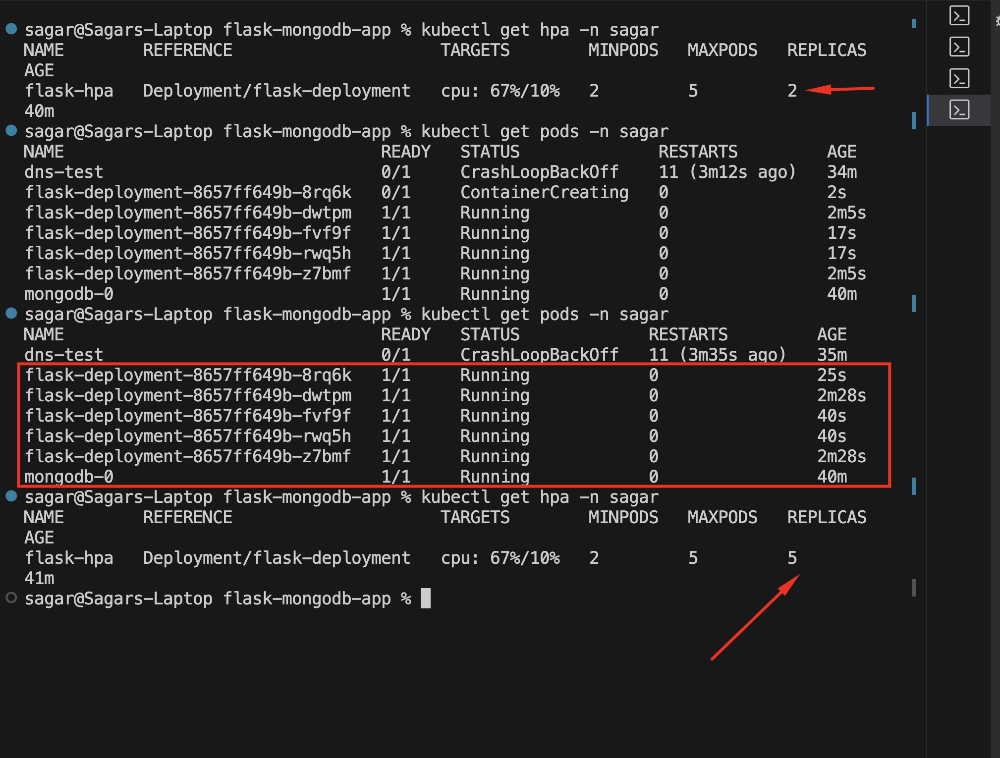
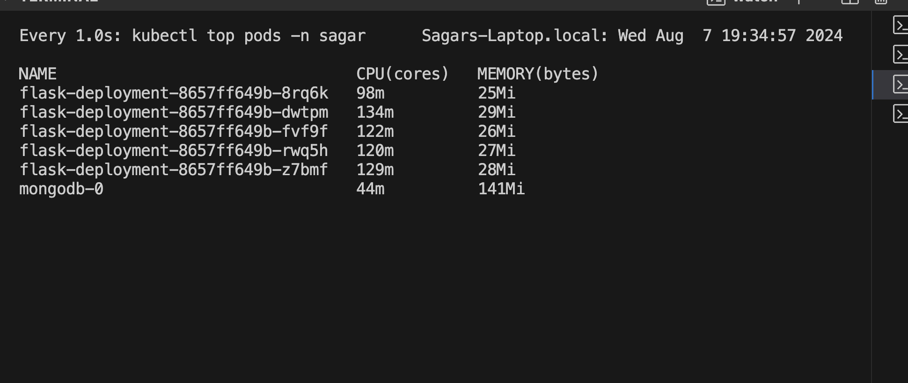
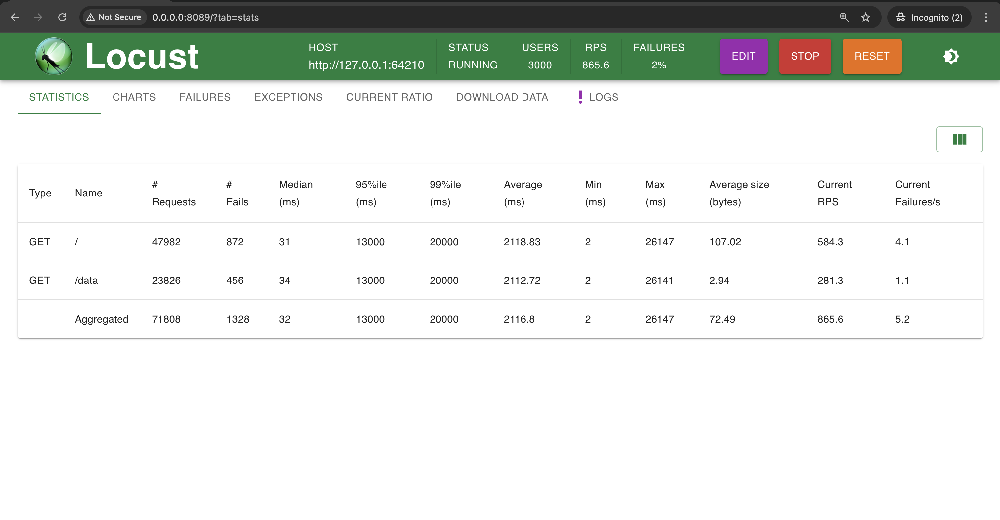

# buy-asg
DevOps Assignment Assignment

Cookie Points: Can you explain the benefits of using a virtual environment for python applications?
Ans - It keeps project's dependencies isolated, preventing conflicts between different projects, and ensures that our global Python setup remains unaffected.

Provide the Dockerfile for the Flask application.
● Provide instructions on how to build and push the Docker image to a container registry. - DONE

sudo docker build -t sagarchauhan2k18/flask-mongodb-app .
docker push sagarchauhan2k18/flask-mongodb-app:latest

● Provide the Kubernetes YAML files for all resources created. - DONE

● Provide a README with detailed steps to deploy the Flask application and MongoDB on a Minikube Kubernetes cluster. - DONE

1. build the dockerfile and push it to Docker Hub or AWS ECR.
2. Setup Minikube on local mac or use AWS EKS 
3. Apply all the given mainfest file or use HELM Charts (better management) - use custom namespace e.g - sagar
4. Run this command to get the Access URL - minikube service flask-service --url -n sagar

In K8s, DNS resolution is handled by the CoreDNS service. Pods can use service names to resolve other services within the cluster. For example, mongodb-service resolves to the MongoDB StatefulSet service, allowing the Flask app to connect to MongoDB using this name.

● Include an explanation of resource requests and limits in Kubernetes.

resources:
          requests: - there should be minimum 200m and 250 MB of memory available in the nodes in the cluster to schedule this pod.
            cpu: "200m"
            memory: "250Mi"
          limits: - It cannot use more than 500 MB of ram and 500 millicpus
            cpu: "500m"
            memory: "500Mi"

minikube addons enable metrics-server

● Design Choices: Describe why you chose the specific configurations and setups, including any alternatives(if any) you considered and why you did not choose them. 

Generally I preferred custom HELM charts for deploying OWN Application or MongoDB but as per the requirements I have used custom manifest files.

● Cookie point: Testing Scenarios: Detail how you tested autoscaling and database interactions, including simulating high traffic. Provide results and any issues encountered during testing.

I write one simple locust testing script and simulate some users on the Application URL so it increases the cpu usages of the pods that triggers the HPA > 10% (testing) and thus it increases the pods to 5 (max limit).

Images are attached below.

